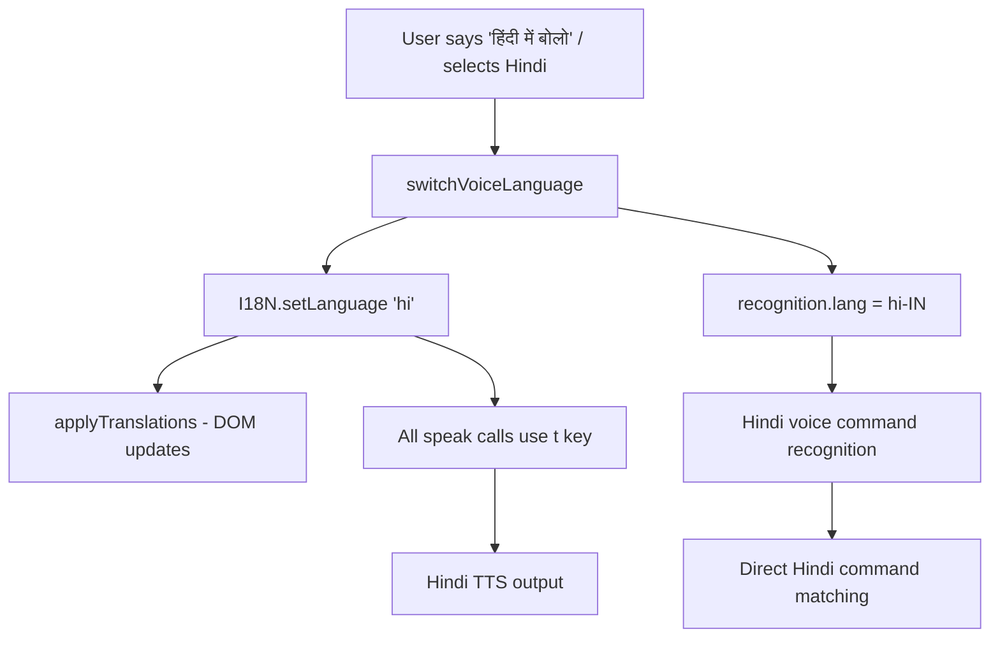

# Hindi Language Support - Walkthrough

## Summary

Added full Hindi language support to AuraMail with a **voice-first** approach. When the user switches to Hindi (via settings or voice command), the entire experience — spoken feedback, voice commands, and UI text — switches to Hindi.

## Architecture

**Key design decisions:**
- **No translation API needed** — all strings are pre-translated in `i18n.js`, so the app no longer needs to call `/api/ai/translate` for voice commands or spoken feedback. This makes it **instant and offline-capable**.
- **Single language selector** — the Voice Language dropdown controls both voice AND UI language.
- **Hindi voice commands mapped directly** — ~50 Hindi commands (e.g., "इनबॉक्स पढ़ें", "ईमेल लिखो") are mapped alongside English commands, so recognition works without any backend translation step.

## Changes Made

### [NEW] [i18n.js](file:///Users/rajatmalik/auramail/i18n.js)
- 300+ translation keys covering both English and Hindi
- `t(key, vars)` function for template string substitution (e.g., `t('youHaveEmails', {count: 5, folder: 'इनबॉक्स'})`)
- `applyTranslations()` updates all DOM elements with `data-i18n` attributes
- `setLanguage(langCode)` switches language and triggers DOM update

### [MODIFY] [index.html](file:///Users/rajatmalik/auramail/index.html)
- Added `data-i18n="key"` attributes to all translatable text elements
- Added `data-i18n-placeholder="key"` for input placeholders
- Added `data-i18n-aria="key"` for accessibility labels
- Added `<script src="i18n.js">` before `app.js`

### [MODIFY] [app.js](file:///Users/rajatmalik/auramail/app.js)
- Added ~50 Hindi voice commands (इनबॉक्स पढ़ो, ईमेल लिखो, जवाब दो, हटाओ, etc.)
- Replaced all ~80+ hardcoded English `speak()` strings with `t()` calls
- Updated `applySettings()` to call `I18N.setLanguage()`
- Updated `switchVoiceLanguage()` to apply UI translations
- Removed translation API calls (no longer needed — i18n handles everything)
- Updated voice tour to use localized strings
- Updated dynamic HTML rendering (email list, badges, timestamps) to use `t()`

## Hindi Voice Commands

| English | Hindi |
|---|---|
| read inbox | इनबॉक्स पढ़ें / इनबॉक्स पढ़ो |
| compose email | ईमेल लिखो / ईमेल लिखें |
| read email | ईमेल पढ़ो / ईमेल पढ़ें |
| reply | जवाब दो / जवाब दें |
| forward | आगे भेजो / आगे भेजें |
| delete | हटाओ / हटाएं / डिलीट करो |
| help | मदद / सहायता |
| go back | वापस जाओ / पीछे जाओ |
| send email | ईमेल भेजो / ईमेल भेजें |
| start dictating | बोलना शुरू करें / बोलना शुरू करो |
| stop dictating | बोलना बंद करें / बोलना बंद करो |
| yes / no (confirm) | हाँ / नहीं |

## Verification

Tested in browser — Hindi UI loads correctly when language is switched:

All UI elements translate: heading, buttons, descriptions, voice status, form labels, and spoken feedback.
